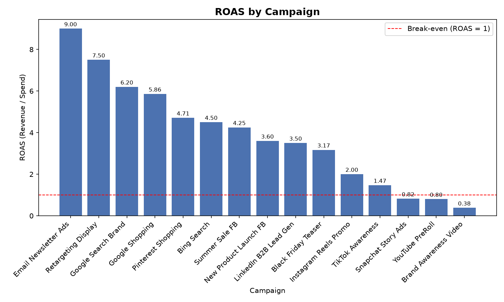
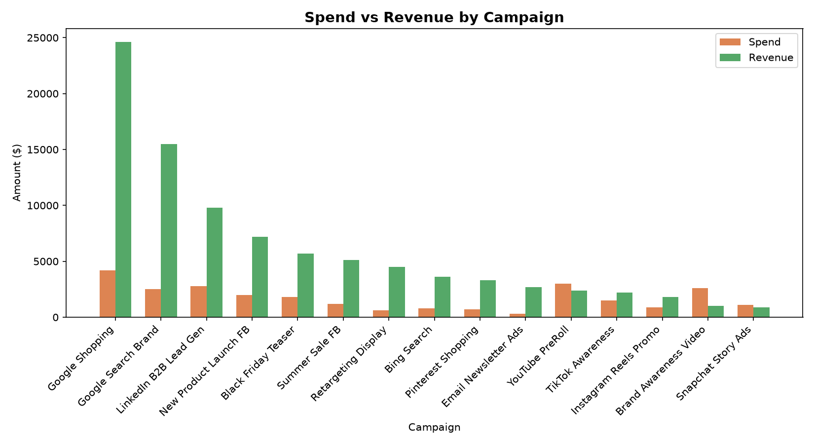

🇹🇷 [Türkçe için tıklayın](README.tr.md)

# AI Marketing Analytics Assistant

An automated tool that analyzes campaign performance data (CSV) and generates AI-powered insights and recommendations — built to automate the weekly campaign reporting process.

##  Purpose

Marketing teams spend significant time manually pulling numbers, calculating metrics, and writing up recommendations for weekly/monthly reports. This tool automates that entire workflow: it ingests raw campaign data, calculates all the key performance metrics, identifies what's working and what isn't, and uses AI to generate concrete, data-driven recommendations — all packaged into a single PDF report.

**In short: data + AI commentary, delivered together, automatically.**

##  Features

- **Automated data ingestion** — reads campaign performance data directly from a CSV file
- **Metric calculation** — automatically computes CTR, CPC, CPA, Conversion Rate, and ROAS for every campaign
- **Performance detection** — automatically flags the best performing campaign (highest ROAS) and the most costly one (highest CPA)
- **AI-generated recommendations** — sends calculated metrics to the OpenAI API and receives concrete suggestions: which campaigns to scale up, which to pause or fix
- **Visual reporting** — generates clear charts (ROAS by campaign, Spend vs Revenue) with Matplotlib
- **PDF report** — compiles the metrics table, charts, and AI insights into a single polished PDF, ready to share or present
- **Automated pipeline** — one command (`python main.py`) runs the entire process end to end

## Sample Output

Below are the charts automatically generated by the pipeline from `data/campaigns_sample.csv`:

### ROAS by Campaign


### Spend vs Revenue


The full report — including the metrics table, both charts above, and AI-generated recommendations — is available here: [`outputs/reports/weekly_report.pdf`](outputs/reports/weekly_report.pdf)

## Tech Stack

- Python
- Pandas — data processing
- Matplotlib — charts
- OpenAI API — AI-generated insights
- ReportLab — PDF report generation

## Project Structure

```
ai-marketing-analytics/
├── data/
│   └── campaigns_sample.csv
├── outputs/
│   ├── charts/
│   └── reports/
├── src/
│   ├── data_loader.py       # CSV loading + metric calculations
│   ├── charts.py            # Chart generation
│   ├── ai.py                # AI insights via OpenAI API
│   ├── report_builder.py    # PDF report generation
│   └── main.py               # Runs the full pipeline
├── .env
├── .gitignore
├── requirements.txt
└── README.md
```

## Setup

1. Clone the repository:
```bash
git clone <repo-url>
cd ai-marketing-analytics
```

2. Create and activate a virtual environment:
```bash
python -m venv venv
source venv/bin/activate  # On Windows: venv\Scripts\activate
```

3. Install dependencies:
```bash
pip install -r requirements.txt
```

4. Create a `.env` file in the project root and add your OpenAI API key:
```
OPENAI_API_KEY=your_key_here
```

## Usage

Run the full pipeline:
```bash
cd src
python main.py
```

This will:
1. Load and analyze `data/campaigns_sample.csv`
2. Calculate CTR, CPC, CPA, Conversion Rate, and ROAS for each campaign
3. Identify the best and worst performing campaigns
4. Generate two charts in `outputs/charts/`
5. Request AI-generated recommendations
6. Build a final PDF report in `outputs/reports/weekly_report.pdf`


## Metrics Explained

| Metric | Formula | Meaning |
|---|---|---|
| CTR | Clicks / Impressions × 100 | Click-through rate |
| CPC | Spend / Clicks | Cost per click |
| CPA | Spend / Conversions | Cost per acquisition |
| Conversion Rate | Conversions / Clicks × 100 | % of clicks that convert |
| ROAS | Revenue / Spend | Return on ad spend |


